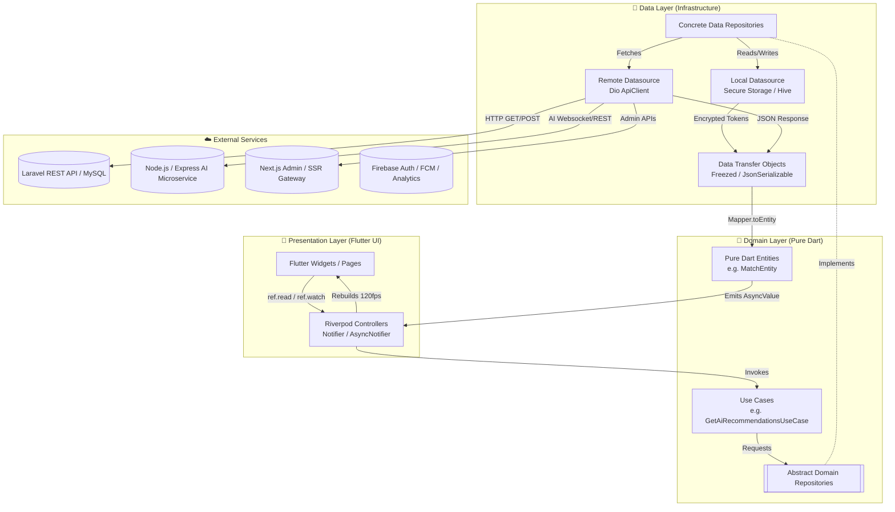
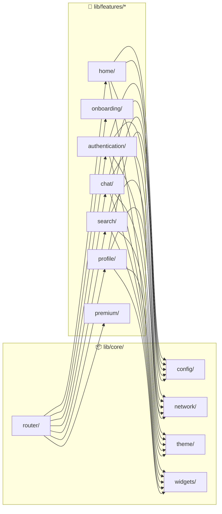
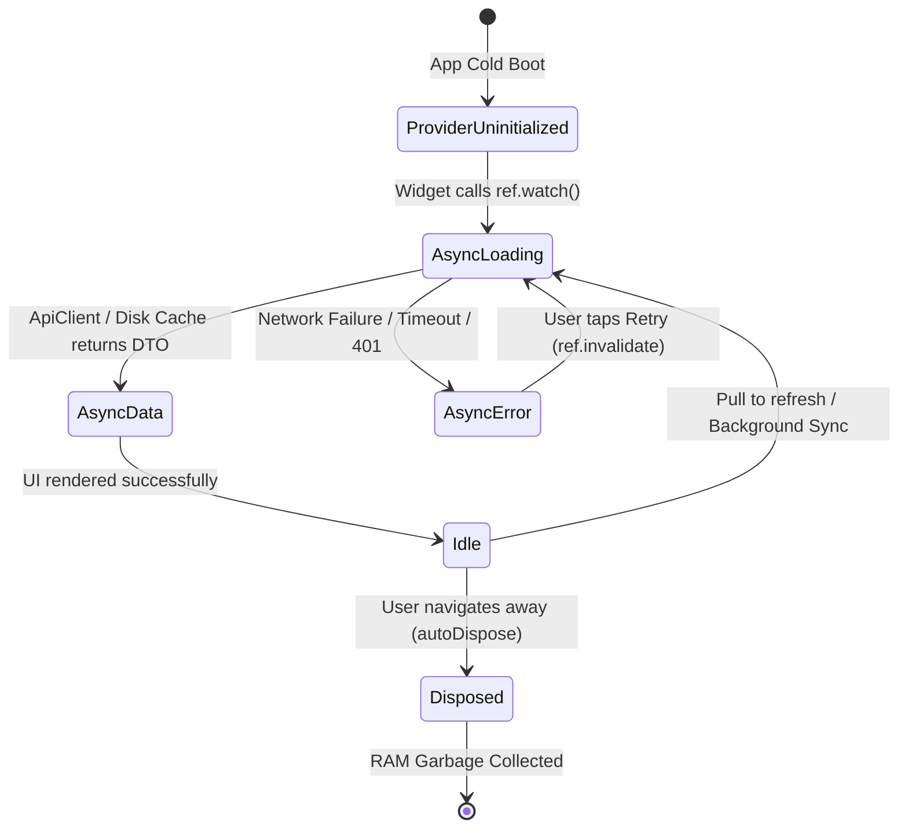
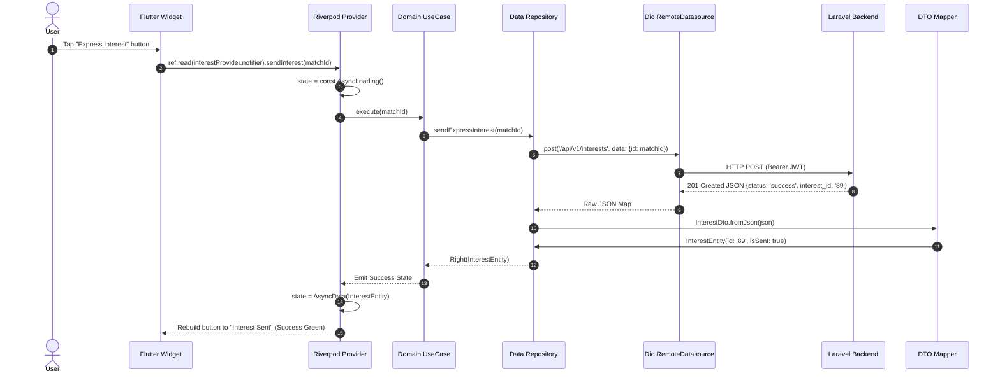
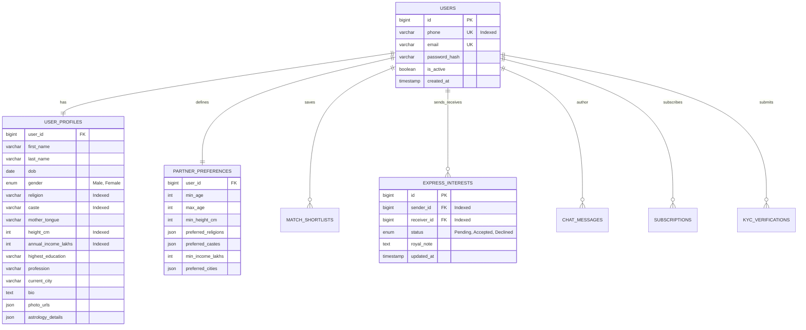

# BRAIN.md — Permanent Engineering Handbook & Single Source of Truth
**Nenjam Matrimony ("Find Your Forever")**  
*Comprehensive AI Systems Architecture, Developer Onboarding Manual, Operational Runbook, and Long-Term Maintenance Reference.*

---

## 📋 Project Identity & Executive Summary

| Attribute | Specification |
| :--- | :--- |
| **Application Name** | Nenjam Matrimony |
| **Tagline** | *Find Your Forever* |
| **Target Domain** | AI-Powered Premium Matrimonial Platform (Luxury Indian Wedding Experience) |
| **Frontend Platform** | Flutter (Latest Stable) / Dart (Latest Stable) |
| **State Management** | Riverpod Generator (`@riverpod`, `NotifierProvider`, `AsyncNotifierProvider`) |
| **Routing & Deep Linking** | GoRouter (`@TypedGoRoute`, nested shell navigation, guard redirects) |
| **Network Stack** | Dio (`ApiClient`, custom auth/logging interceptors, environment base URIs) |
| **Design System** | Luxury Material 3 (`#1B2B4B` Navy, `#C9A84C` Royal Gold, `#FBF9F4` Ivory Background) |
| **Responsive Targets** | Android, iOS, Tablets, Foldables, Desktop (Web ready), Landscape/Portrait |
| **Backend (Planned)** | Laravel REST API + Node.js / Express.js Microservices + Next.js Admin Portal |
| **Database (Planned)** | MySQL 8.0+ Enterprise Cluster (Sharded / Read-Replica Ready) |
| **Architecture Pattern** | Feature-First Clean Architecture (Presentation $\rightarrow$ Domain $\rightarrow$ Data) |
| **Scale Target** | 10+ Million Concurrent Users Across Android & iOS |

---

## 1. High-Level System Overview

### 1.1 Architectural Philosophy & Purpose
Nenjam Matrimony is engineered from the ground up to solve the fragmentation, unreliability, and dated user interfaces present in legacy matrimonial platforms (e.g., BharatMatrimony, Shaadi). The system adheres strictly to **Feature-First Clean Architecture**, separating software responsibilities into three distinct layers across self-contained domain features:
1. **Presentation Layer (`presentation/`)**: Pure UI rendering. Contains Flutter widgets, pages, and Riverpod controllers (`Notifiers`). Absolutely zero business logic, network formatting, or direct storage calls occur here.
2. **Domain Layer (`domain/`)**: The core business logic invariants. Contains abstract `Repositories`, pure Dart `Entities` (framework-agnostic), and single-responsibility `UseCases`.
3. **Data Layer (`data/`)**: Concrete infrastructure implementations. Contains REST API `Datasources`, local disk storage (`SharedPreferences` / `FlutterSecureStorage`), network `DTOs` (Data Transfer Objects), and bidirectional `Mappers`.

### 1.2 Unidirectional Data Flow (UDF)
Data flows strictly in one direction throughout the application lifecycle:
- **User Action**: A user interacts with a widget (e.g., swiping a match profile card).
- **Riverpod Controller Trigger**: The widget invokes a method on an injected Riverpod `NotifierProvider` or `AsyncNotifierProvider`.
- **UseCase Execution**: The provider delegates the business intent to a pure Dart `UseCase`.
- **Repository Abstraction**: The UseCase calls an abstract method on the `Domain Repository`.
- **Datasource Network/Disk Query**: The concrete `Data Repository` implementation delegates to a `RemoteDatasource` (Dio HTTP request) or `LocalDatasource` (Cache/Secure Storage).
- **Transformation Pipeline**: Raw JSON responses are decoded into serializable `DTOs` (via `freezed` & `json_serializable`), converted into pure Dart `Entities` via `Mappers`, and returned up the UDF chain to update Riverpod state.
- **Reactive UI Rebuild**: Flutter widgets watching (`ref.watch`) the provider reactively rebuild with smooth 120fps animations.

### 1.3 Core Infrastructure Pillars
- **Riverpod Caching & Auto-Dispose**: Providers automatically cache network responses. Unused feature states are automatically garbage collected (`autoDispose`) to guarantee minimal RAM footprint on mobile devices.
- **GoRouter Declarative Navigation**: Navigation is entirely URL/route-based, supporting web URLs, deep linking, auth redirect guards, and nested `ShellRoutes` for persistent bottom tabs and side drawers.
- **Runtime Environment Switching**: Initialized via shared `bootstrap.dart`, reading flavor-specific `.env.dev`, `.env.qa`, `.env.staging`, and `.env.production` assets.

---

## 2. Comprehensive Architecture Diagrams

### 2.1 System Clean Architecture & Data Flow


### 2.2 Feature Folder Dependency Graph


---

## 3. Project Folder Guide

The Nenjam Matrimony codebase strictly follows an enterprise folder taxonomy. Developers and AI agents must maintain this exact structure.

```text
nenjam_matrimony/
├── .agents/                 # Workspace customizations, agent skills, and operational rules
├── android/                 # Native Android Gradle project & flavor configurations
├── ios/                     # Native iOS Xcode workspace & scheme configurations
├── assets/                  # Static design resources
│   ├── fonts/               # Local fallback fonts (Inter, Poppins)
│   ├── icons/               # Custom SVG brand icon packs
│   ├── images/              # High-resolution WebP/PNG placeholders
│   └── l10n/                # ARB localization string files
├── lib/                     # Application source code
│   ├── bootstrap.dart       # Shared async initialization logic (Env, Firebase, Dio)
│   ├── main.dart            # Default development entry point
│   ├── main_dev.dart        # Flavor entry point: Development environment
│   ├── main_qa.dart         # Flavor entry point: Quality Assurance environment
│   ├── main_staging.dart    # Flavor entry point: Staging environment
│   ├── main_production.dart # Flavor entry point: Production live environment
│   ├── core/                # Cross-cutting global infrastructure (Shared across features)
│   │   ├── animations/      # Reusable micro-animations (AppAnimations wrapper)
│   │   ├── config/          # AppConfig singleton, environment parsers, Firebase selectors
│   │   ├── constants/       # Spacing tokens, dimensions, regex patterns, asset paths
│   │   ├── network/         # Dio ApiClient, JWT interceptors, API endpoints registry
│   │   ├── router/          # GoRouter configuration, route transitions, auth guards
│   │   ├── services/        # StorageService, LoggerService, DeviceInfoService
│   │   ├── theme/           # Material 3 design tokens, AppColors, AppTypography, DesignSystem barrel
│   │   ├── utils/           # Responsive formatting, input validators, date formatters
│   │   └── widgets/         # Atomic UI library (Buttons, Inputs, Cards, Avatars, Dialogs, Sheets)
│   └── features/            # Self-contained domain modules
│       ├── authentication/  # Login, OTP verification, password reset
│       ├── chat/            # Real-time WebSocket messaging, media sharing
│       ├── home/            # Dashboard, AI recommendation feeds, visitor logs
│       ├── matches/         # Reels-style vertical scrolling match discovery
│       ├── onboarding/      # Partner preference surveys, KYC documentation
│       ├── premium/         # Royal subscription tier upsells, payment gateway
│       ├── profile/         # Profile management, bio editor, photo galleries
│       ├── registration/    # Multi-step matrimonial account creation
│       ├── search/          # Advanced filtering (caste, education, income, astrology)
│       └── verification/    # Aadhaar/ID verification badge workflows
└── test/                    # Unit, Widget, and Golden test suites
```

### 3.1 Folder Extension Rules
- **Adding a New Global Component**: Place reusable UI elements strictly inside `lib/core/widgets/<category>/`. Never place feature-specific UI in `core`.
- **Adding a New Feature**: Create a folder under `lib/features/<feature_name>/` containing exactly three subdirectories: `data/`, `domain/`, and `presentation/`.
- **Forbidden Practices**:
  - ❌ **NEVER** place HTTP network calls or JSON parsing inside `presentation/` widgets.
  - ❌ **NEVER** import Flutter UI packages (`package:flutter/material.dart`) inside `domain/` entities or repositories.
  - ❌ **NEVER** commit plain-text API keys or database passwords. All secrets must reside in `.env.*` files excluded by `.gitignore`.

---

## 4. Exhaustive Feature Documentation

Every domain feature is isolated to prevent cascading build failures and enable parallel team development.

### 4.1 Foundational Features
* **Splash (`features/splash/`)**:
  * *Purpose*: Seamless app boot experience while verifying authentication tokens and warming up API connections.
  * *Responsibilities*: Renders royal brand radial gradient, executes `AppConfig` validation, transitions to Language Selection or Home based on auth state.
* **Language Selection (`features/language/` & `language_selection/`)**:
  * *Purpose*: Localizes the entire user interface prior to onboarding.
  * *Responsibilities*: Stores locale choice (`ta_IN`, `en_US`, `te_IN`) in `StorageService`, dynamically swaps Flutter `AppLocalizations`.
* **Onboarding (`features/onboarding/`)**:
  * *Purpose*: Educates users on the AI matchmaking engine and captures foundational partner criteria.

### 4.2 Account & Verification Features
* **Authentication (`features/authentication/`)**:
  * *Purpose*: Secure phone number OTP and credential login.
  * *Endpoints*: `POST /api/v1/auth/login`, `POST /api/v1/auth/verify-otp`, `POST /api/v1/auth/refresh`.
  * *Storage*: Saves encrypted JWT Bearer and Refresh tokens in `FlutterSecureStorage`.
* **Registration (`features/registration/`)**:
  * *Purpose*: Multi-step profile intake (Basic info, Religious background, Education/Profession, Horoscope, Bio).
  * *Database Tables*: `users`, `user_profiles`, `partner_preferences`.
* **Verification Badges (`features/verification/`)**:
  * *Purpose*: Eliminates fake accounts by verifying government ID (Aadhaar, PAN, Passport) and live facial biometrics.
  * *Badges Issued*: `Verified Blue` (`#1565C0`), `Face Verified Green` (`#43A047`).

### 4.3 Discovery & Matchmaking Features
* **Home Dashboard (`features/home/`)**:
  * *Purpose*: Central hub showcasing AI Daily Recommendations, Recent Visitors, and Express Interest summaries.
  * *Widgets*: `NmAiRecommendationCard`, `NmVisitorCard`, `NmInterestCard`.
* **Reels-Style Vertical Matches (`features/matches/`)**:
  * *Purpose*: Immersive, high-engagement full-screen match discovery scrolling vertically like TikTok / Instagram Reels.
  * *Interactions*: Swipe Up (Next Match), Tap Heart (Shortlist), Tap Star (Express Royal Interest), Share Button (Generate encrypted shareable link).
* **Advanced Search & Filters (`features/search/`)**:
  * *Purpose*: Granular query engine supporting 40+ matrimonial criteria.
  * *Components*: `NmFilterChip`, `NmRangeSlider`, `NmReligionSelector`, `NmCasteSelector`.
* **AI Matchmaking Engine (`Planned Core Service`)**:
  * *Purpose*: Calculates 100-point compatibility score based on lifestyle alignment, communication patterns, and family values.
  * *UI Display*: `NmCompatibilityCard` with animated radial progress indicator.
* **Astrology & Horoscope (`Planned Core Feature`)**:
  * *Purpose*: Traditional South Indian & North Indian Koota / Porutham matching (10 Poruthams calculation).

### 4.4 Communication & Monetization
* **Real-Time Chat (`features/chat/`)**:
  * *Purpose*: Instant secure messaging between mutual matches.
  * *Stack*: WebSocket connection backed by Node.js/Express microservice + Firebase Cloud Messaging (FCM) push alerts.
* **Royal Premium Subscriptions (`features/premium/` & `subscription/`)**:
  * *Purpose*: Monetizes the platform via tiered VIP access (Gold, Diamond, Royal VIP).
  * *Perks*: Unlimited contact unlocks, AI horoscope compatibility reports, dedicated relationship manager.

---

## 5. Luxury Design System Systematics

The Nenjam Matrimony UI is crafted to convey royalty, trust, and timeless elegance. All components reside in `lib/core/theme/` and are exported via `design_system.dart`.

### 5.1 Color Palette Definitions
| Token Name | Hex Code | Visual Role & Usage |
| :--- | :--- | :--- |
| `AppColors.primary` | `#1B2B4B` | Deep Royal Navy. Used for top app bars, primary buttons, and headings. |
| `AppColors.primaryLight`| `#2D4A7A` | Soft Slate Navy. Secondary gradients and surface containers. |
| `AppColors.accentGold` | `#C9A84C` | Royal Wedding Gold. Premium badges, glowing borders, active tab icons. |
| `AppColors.premiumGold` | `#FFD54F` | Vibrant VIP Gold. Shimmer highlights and royal subscription cards. |
| `AppColors.backgroundLight`| `#FBF9F4` | Warm Ivory. Soothing background reducing eye strain compared to pure white. |
| `AppColors.surfaceLight` | `#FFFFFF` | Pure Surface White. Elevated profile cards and dialog modals. |
| `AppColors.verifiedBlue` | `#1565C0` | Trust Blue. Government ID verification checkmark badges. |
| `AppColors.success` | `#2E7D32` | Emerald Green. Acceptance notifications and online status indicators. |
| `AppColors.error` | `#D32F2F` | Crimson Red. Destructive actions, profile report warnings, network errors. |

### 5.2 Typography & Elevation Tokens
- **Heading Font**: `Poppins` (Display Large `57sp`, Headline Large `32sp`, Title Large `22sp`).
- **Body Font**: `Inter` (Body Large `16sp`, Body Medium `14sp`, Caption `11sp`).
- **Domain Styles**: `otpDigits` (`24sp`, w700, `8dp` letter spacing), `subscriptionTitles` (`18sp`, w700 gold).
- **Radius System (`AppRadius`)**: `r8`, `r12`, `r16`, `r20`, `r24`, `r32`, `r999` (Pill).
- **Elevation System (`AppElevation`)**: Flat (`0`), Low (`2`), Medium (`4`), High (`8`), Floating (`16` with soft gold/navy dispersed glow).

---

## 6. Responsive Architecture System

Every screen and atomic widget in Nenjam Matrimony must fluidly adapt to heterogeneous screen dimensions across iOS and Android ecosystems without hardcoded pixel widths or layout clipping (`RenderFlex overflow`).

### 6.1 Breakpoints & Layout Resolvers
The system utilizes centralized responsive utilities (`lib/core/utils/responsive_utils.dart`) to classify runtime device viewports:
- **Compact (Phone Portrait)**: Width $< 600\text{dp}$. Single-column vertical layout. Standard navigation bar at bottom.
- **Medium (Foldables & Tablets Portrait)**: $600\text{dp} \le \text{Width} < 840\text{dp}$. Two-column split grids, master-detail layout previews, side navigation rail.
- **Expanded (Tablets Landscape & Web)**: Width $\ge 840\text{dp}$. Permanent side navigation drawer, multi-card horizontal reels, persistent filter panels.

### 6.2 Adaptive Insets & Text Scaling
- **Safe Areas**: All `Scaffold` bodies are automatically padded to respect iPhone Dynamic Islands, notch cutouts, gesture navigation bars, and Android edge-to-edge system bars.
- **Keyboard Insets**: Modals and bottom sheets (`AppSheets.show`) dynamically bind to `MediaQuery.of(context).viewInsets.bottom` to ensure text inputs scroll smoothly above virtual keyboards.
- **Dynamic Text Scaling**: All text components utilize relative font scaling (`MediaQuery.textScalerOf`). Layout containers wrap text in `Expanded` or `Flexible` with `TextOverflow.ellipsis` to prevent crashes when elderly users enable 200% Accessibility Large Fonts.

---

## 7. Declarative Navigation Flow

Nenjam Matrimony utilizes `GoRouter` (`lib/core/router/app_router.dart`) for type-safe routing, deep linking, and nested shell transitions.

### 7.1 Master Application Route Map
```mermaid
graph TD
    SPLASH([/splash]) -->|Auth Check| LANG[/language]
    LANG --> ONB[/onboarding]
    ONB --> CREATE[/register/profile]
    CREATE --> LOGIN[/auth/login]
    LOGIN --> OTP[/auth/otp]
    OTP --> REG[/register/complete]
    REG --> HOME[/home]

    subgraph Authenticated Shell ["📱 Main Authenticated Shell"]
        HOME --> REELS[/matches/reels<br/>Save & Share]
        HOME --> INBOX[/chat/inbox]
        HOME --> ASTRO[/astrology]
        HOME --> PREM[/premium/royal]
        HOME --> PROF[/profile<br/>Drawer: 3 lines top left]
    end

    PROF --> SETTINGS[/settings]
    REELS -->|Tap Match| CHAT[/chat/room/:id]
    INBOX -->|Open Room| CHAT
```

### 7.2 Key Transition Dynamics
- **Splash $\rightarrow$ Auth Guard**: GoRouter evaluates `ref.watch(authProvider)`. If unauthenticated, unauthorized access to `/home` or `/profile` instantly redirects to `/auth/login`.
- **Reels Match Discovery (`/matches/reels`)**: Utilizes custom `CustomTransitionPage` with zero-latency slide transitions. The Save & Share action triggers a native bottom sheet generating deep links (`nenjam://match/:id`).
- **Profile Navigation Drawer**: The top-left hamburger icon (3 horizontal lines) opens `NmDrawer` (`lib/core/widgets/navigation/app_drawer.dart`), granting one-tap access to Settings, Verification KYC, Royal Subscriptions, and Help Desks.

---

## 8. Riverpod State Flow & Hierarchy

State management is powered entirely by **Riverpod Generator** (`@riverpod`), ensuring compile-time type safety, automated dependency injection, and deterministic state lifecycles.

### 8.1 Provider Hierarchy & Lifecycle


### 8.2 Provider Rules & Caching Strategy
- **`NotifierProvider`**: Synchronous UI state (e.g., `FilterChipNotifier` tracking active search criteria).
- **`AsyncNotifierProvider`**: Asynchronous domain data (e.g., `DailyRecommendationsNotifier` fetching profile matches).
- **KeepAlive vs AutoDispose**: Global session providers (e.g., `CurrentUserNotifier`, `AppConfigNotifier`) use `@Riverpod(keepAlive: true)`. Transient feature screens (e.g., Visitor history) default to `autoDispose` to reclaim mobile memory upon route exit.
- **Optimistic Updates**: Tapping 'Shortlist Heart' immediately mutates local Riverpod state to reflect liked status before waiting for the asynchronous network HTTP confirmation.

---

## 9. End-to-End Data Flow

The following sequence diagram traces the exact reverse-engineered journey of data when a user triggers an action.



---

## 10. Future Laravel Backend Integration

Nenjam Matrimony is structured to integrate cleanly with an enterprise **Laravel 11+ REST API** backed by MySQL.

### 10.1 Expected API Contract & Endpoint Specification

| Module | HTTP Method | Endpoint URI | Request Payload / Params | Expected Response Schema |
| :--- | :--- | :--- | :--- | :--- |
| **Auth** | `POST` | `/api/v1/auth/otp/request` | `{ "phone": "+919876543210" }` | `200 OK` `{ "message": "OTP sent", "hash": "e8f..." }` |
| **Auth** | `POST` | `/api/v1/auth/otp/verify` | `{ "phone": "...", "otp": "123456" }` | `200 OK` `{ "token": "jwt...", "refresh": "r_jwt...", "user": {...} }` |
| **Profile**| `GET` | `/api/v1/profiles/me` | *Headers: Authorization Bearer* | `200 OK` `ProfileDto` (Basic, Religion, Education, Photos) |
| **Profile**| `PUT` | `/api/v1/profiles/bio`| `{ "about_me": "Software Engineer..." }`| `200 OK` `{ "status": "updated" }` |
| **Matches**| `GET` | `/api/v1/matches/reels`| `?cursor=20&limit=10&gender=female` | `200 OK` `{ "data": [MatchDto], "next_cursor": "30" }` |
| **Search** | `POST` | `/api/v1/search/advanced`| `{ "caste": ["Iyer"], "min_income": 10 }`| `200 OK` paginated `MatchDto` array |
| **Chat** | `GET` | `/api/v1/chat/rooms` | *Bearer Token* | `200 OK` `List<ChatRoomDto>` |
| **Chat** | `POST` | `/api/v1/chat/rooms/:id/message` | `{ "content": "Hello!", "type": "text" }`| `201 Created` `ChatMessageDto` |
| **VIP** | `GET` | `/api/v1/premium/plans`| *None* | `200 OK` `List<SubscriptionPlanDto>` |
| **AI** | `POST` | `/api/v1/ai/compatibility` | `{ "target_profile_id": "8932" }` | `200 OK` `{ "score": 94, "points": [...] }` |

---

## 11. Database Architecture & Schema Planning

The planned **MySQL Enterprise Cluster** schema is fully normalized to 3NF to eliminate data anomalies while employing strategic indexing for high-throughput discovery queries.

### 11.1 Entity Relationship Diagram (ERD)


### 11.2 Indexing & Performance Strategy
- **Composite Indexes**: Discovery queries routinely filter by `(gender, religion, caste, annual_income_lakhs)`. A composite B-tree index on `user_profiles(gender, religion, caste, annual_income_lakhs)` guarantees sub-10ms query execution across millions of rows.
- **Foreign Keys & Cascades**: Deleting an account (`DELETE FROM users WHERE id = :id`) employs `ON DELETE CASCADE` across `user_profiles`, `partner_preferences`, and `kyc_verifications` to adhere strictly to DPDP / GDPR Right to be Forgotten mandates.

---

## 12. Enterprise Security Architecture

Security is non-negotiable for a luxury matrimonial brand entrusted with sensitive personal KYC and family details.

### 12.1 Authentication & Encryption Matrix
- **JWT & Automatic Refresh**: Access tokens expire every 15 minutes. Dio's `AuthInterceptor` intercepts `401 Unauthorized` responses, pauses active HTTP requests, calls `POST /api/v1/auth/refresh` using the persistent Refresh Token stored in hardware-backed `FlutterSecureStorage` (iOS Keychain / Android Keystore), and transparently retries queued network calls.
- **API Payload Validation**: Laravel backend employs FormRequest validation rules. All mobile inputs (`NmTextField`) undergo strict regex checks prior to network transmission to block SQL injection and Cross-Site Scripting (XSS).
- **Media Upload Security**: Uploaded profile photos undergo server-side EXIF stripping, malware scanning, and conversion into encrypted WebP blobs delivered via signed CloudFront CDN URLs expiring in 60 minutes.

---

## 13. High-Performance Engineering Strategy

Mobile performance tuning targets steady **60fps on budget Android devices** and **120fps ProMotion on iPhone Pro** models.

### 13.1 Caching & Memory Optimizations
- **Image Caching Pipeline**: `CachedNetworkImage` combined with `flutter_cache_manager` stores decoded WebP bitmaps in local disk cache. Memory cache sizes are bounded (`memCacheWidth: 600`) to prevent out-of-memory `BitmapAllocation` crashes when infinite scrolling Reels.
- **Reels Pagination & Lazy Loading**: Vertical match discovery (`features/matches/`) fetches profiles in chunks of 10 (`limit=10&cursor=X`). As the user reaches index 7, Riverpod proactively pre-fetches the next chunk in background isolates.
- **Provider Auto-Disposal**: Every transient Riverpod provider uses `autoDispose`. When a user exits the chat screen or search filters, associated `StateNotifier` memory allocations are immediately freed.

---

## 14. Offline Synchronization Strategy

The mobile application remains partially functional during intermittent network drops common in Indian transit routes.

### 14.1 Caching & Queue Resolution
- **Dio HTTP Caching**: `dio_http_cache` caches `GET` responses (e.g., Daily Matches, Horoscope Porutham charts) for 24 hours. When offline, `NmNoInternetWidget` offers instant cached data inspection.
- **Optimistic Action Queue**: If network drops while sending a Chat Message or Express Interest, the mutation is serialized into local SQLite disk queue. Once internet connectivity restores (`ConnectivityResult.mobile` / `wifi`), a background sync isolate flushes queued actions in chronological sequence.

---

## 15. Planned Artificial Intelligence Engines

Nenjam Matrimony differentiates itself from rule-based legacy matrimonial sites via 5 dedicated AI microservices.

### 15.1 Core AI Modules & Responsibilities
1. **Compatibility Scoring Engine (Node.js/Python)**: Evaluates 40+ vector embeddings (hobbies, career trajectory, family values, financial habits) using cosine similarity to output the `94% AI Match Compatibility` score.
2. **Astrology Porutham Resolver**: Computes traditional 10-Porutham (Dashakoota) astrological alignment instantly from birth date, time, and coordinates.
3. **Fraud & Fake Profile Detector**: Evaluates live selfie video captures against uploaded Aadhaar card photos using facial landmarks detection to issue the `Face Verified Green Badge`.
4. **Conversational AI Icebreaker**: Generates context-aware, culturally elegant first message suggestions based on shared hobbies.
5. **Smart Profile Ranking**: Demotes inactive accounts and boosts verified VIP Royal profiles to the top of daily discovery feeds.

---

## 16. Comprehensive Testing Strategy

Engineering excellence requires maintaining $>85\%$ test coverage across domain invariants and UI components.

### 16.1 Test Pyramid Matrix
1. **Unit Tests (`test/domain/` & `test/data/`)**: Verifies pure Dart `UseCases`, `Entities`, `Validators`, and `DTO Mappers` without Flutter framework overhead. Employs `mocktail` or `mockito` to stub repository responses.
2. **Widget Tests (`test/presentation/`)**: Mounts atomic widgets (`NmPrimaryButton`, `NmDropdown`) inside `ProviderScope` stubs using `pumpWidget`. Asserts UI state changes, accessibility semantic labels, and tap gestures.
3. **Golden Tests (`test/goldens/`)**: Pixel-perfect regression testing across iPhone SE, foldables, and tablets. Detects inadvertent UI layout regressions or font misalignment before merge commits.
4. **Integration Tests (`integration_test/`)**: End-to-end device testing automating complete user flows (Onboarding $\rightarrow$ Registration $\rightarrow$ Reels Swipe $\rightarrow$ Express Interest).

---

## 17. Deployment & DevOps Strategy

Release builds are deterministically generated via CI/CD pipelines targeting multi-flavor stores.

### 17.1 Flavor Build Configuration
- **Android**: Configured via `productFlavors` in `android/app/build.gradle` (`dev`, `qa`, `staging`, `production`). Entry points: `flutter build appbundle -t lib/main_production.dart --flavor production`.
- **iOS**: Configured via Xcode User-Defined Build Settings (`APP_FLAVOR`). Entry points: `flutter build ipa -t lib/main_production.dart --flavor production`.
- **Secrets Management**: GitHub Actions secrets inject production keystores, API signing certificates, and `.env.production` variables during isolated CI runners. Never embed API keys inside repo commits.

---

## 18. Enterprise Coding Standards

All team developers and automated agents adhere strictly to consistent syntax and design conventions.

### 18.1 Conventions Checklist
- **Naming Conventions**:
  - Files: `snake_case.dart` (e.g., `ai_recommendation_card.dart`).
  - Classes & Enums: `UpperCamelCase` (e.g., `NmPrimaryButton`, `AppEnvironment`).
  - Variables & Providers: `lowerCamelCase` (e.g., `dailyMatchesProvider`, `userProfile`).
- **Widget Composition**: Always prefer composition over inheritance. Break screens exceeding 150 lines into private sub-widgets (`_MatchMetadataHeader`).
- **Const Correctness**: Enforced via analysis lint `prefer_const_constructors`. Always mark constructors and static UI tokens `const` to eliminate redundant RAM allocations during widget rebuilds.
- **Git Commit Etiquette**: Conventional Commits standard (`feat: add royal interest badge`, `fix: resolve reels flex overflow on foldables`).

---

## 19. Technical Debt & Risk Register

Proactive tracking of architectural bottlenecks and planned mitigations.

| Risk ID | Category | Bottleneck / Assumption | Impact | Planned Mitigation Roadmap |
| :--- | :--- | :--- | :--- | :--- |
| **TD-01** | Network | Dio HTTP calls currently lack retry jitter policies during cellular 2G/3G drops. | Failed match requests during train commutes. | Integrate `dio_smart_retry` with exponential backoff. |
| **TD-02** | Storage | Secure Storage reads on cold boot synchronously block Splash animations on older Android 8 devices. | 300ms frame stutter upon app launch. | Pre-warm secure storage isolate during `bootstrap()`. |
| **TD-03** | Database | Local SQLite offline queue currently lacks conflict resolution timestamps. | Out-of-order chat messages if online/offline rapidly. | Migrate offline storage layer to Isar / Realm with vector clocks. |
| **TD-04** | UI | Reels vertical scrolling currently loads 10 full-res images per chunk. | High cellular mobile data consumption. | Integrate CloudFront dynamic WebP image compression params (`?w=400&q=75`). |

---

## 20. Instructions for Future AI Agents

> [!CAUTION]
> **MANDATORY READING FOR ALL AUTOMATED CODING AGENTS**: You are modifying a production-grade enterprise codebase. Adhere strictly to the following architectural invariants. Failure to follow these rules will introduce regressions and break the system design.

### 20.1 Architectural Commandments
1. **NEVER Duplicate Widgets**: Before creating any button, input, card, chip, dialog, or bottom sheet, check `lib/core/theme/design_system.dart`. You **MUST** inherit existing `NmPrimaryButton`, `NmTextField`, `NmDropdown`, `NmVisitorCard`, and `AppDialogs`. Creating ad-hoc UI is strictly forbidden.
2. **Respect Layer Boundaries**:
   - `presentation/`: Only widgets and Riverpod Notifiers. Never put HTTP calls or JSON serialization here.
   - `domain/`: Pure Dart business logic. Never import Flutter UI packages or concrete HTTP clients here.
   - `data/`: Infrastructure network calls and storage. Must implement abstract domain repositories.
3. **Strict Design System Adherence**:
   - Colors: Use only `AppColors.*`. Never hardcode hex codes (`Color(0xFF...)`) in feature screens.
   - Typography: Use only `AppTypography.*` (`Poppins` headings, `Inter` body).
   - Dimensions: Use only `AppSpacing.*` and `AppRadius.*`. No magic numbers (`SizedBox(height: 17)`).
4. **State Management Protocol**:
   - Use only Riverpod Generator (`@riverpod`).
   - Global session providers must use `@Riverpod(keepAlive: true)`.
   - Feature screen providers must use `autoDispose` to preserve mobile RAM.
5. **Safety & Verification Mandate**:
   - Do **NOT** modify routing names or foundational network client setups unless explicitly instructed.
   - After making any edits, you **MUST** run `flutter analyze` to verify 0 compilation warnings or lints.
   - You **MUST** run `flutter test` to ensure all existing unit and smoke tests pass.
   - Keep all `.env.*` secrets excluded from git commits.

---
*End of BRAIN.md Handbook. Nenjam Matrimony Foundation Architecture Ground Truth.*
