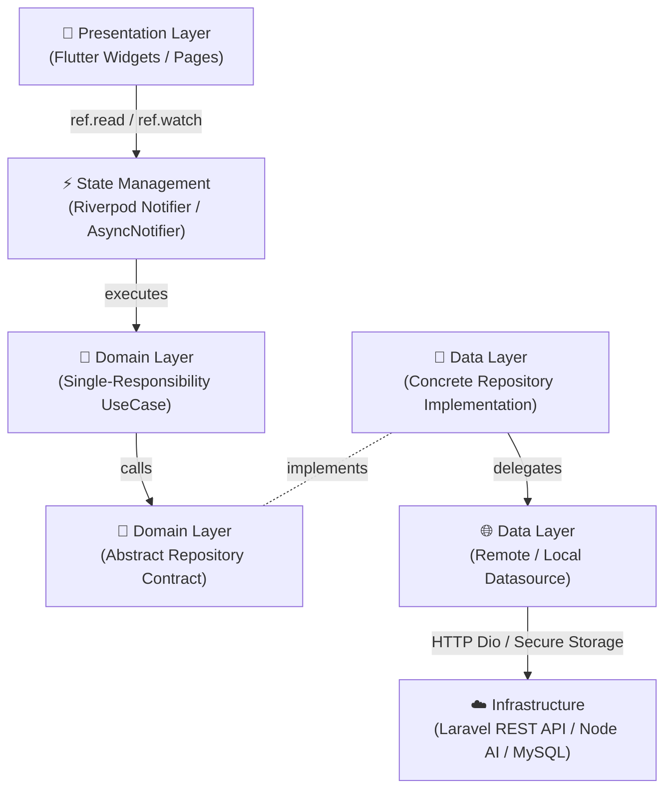
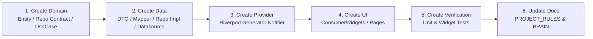

# PROJECT_RULES.md — The Engineering Constitution & Mandatory Rulebook

**Application Name**: Nenjam Matrimony (*Find Your Forever*)  
**Platform**: Flutter Mobile (iOS & Android) / Dart  
**Document Classification**: Supreme Engineering Constitution (Single Source of Architectural Invariants)

---

## 🏛️ Constitutional Supremacy Clause
This document (`PROJECT_RULES.md`) is the supreme constitution governing the **Nenjam Matrimony** codebase. Every developer, software engineer, tech lead, and autonomous AI coding agent working on this repository **MUST** adhere strictly to the rules, patterns, constraints, and prohibitions defined herein.

> [!IMPORTANT]
> **Supremacy Mandate**: If there is ever a conflict, discrepancy, or contradiction between existing generated source code, third-party tutorials, or AI agent assumptions and this document, **`PROJECT_RULES.md` ALWAYS WINS**. Code violating these rules is considered defective and must be rejected or refactored immediately during code review or automated validation.

---

## Table of Contents
1. [Project Philosophy](#1-project-philosophy)
2. [Architecture Rules](#2-architecture-rules)
3. [Folder Rules](#3-folder-rules)
4. [Flutter Rules](#4-flutter-rules)
5. [Responsive Rules](#5-responsive-rules)
6. [UI Rules](#6-ui-rules)
7. [Component Rules](#7-component-rules)
8. [State Management Rules](#8-state-management-rules)
9. [Repository Rules](#9-repository-rules)
10. [Model Rules](#10-model-rules)
11. [Error Handling](#11-error-handling)
12. [Performance Rules](#12-performance-rules)
13. [Accessibility Rules](#13-accessibility-rules)
14. [Security Rules](#14-security-rules)
15. [Code Style](#15-code-style)
16. [Git Rules](#16-git-rules)
17. [Testing Rules](#17-testing-rules)
18. [AI Rules](#18-ai-rules)
19. [Definition of Done](#19-definition-of-done)
20. [Future Development Rules](#20-future-development-rules)

---

## 1. Project Philosophy

### 1.1 Why Nenjam Matrimony Exists
Legacy matrimonial platforms (e.g., Bharat Matrimony, Shaadi.com, Jeevansathi) suffer from cluttered, anxiety-inducing user interfaces, unverified profiles, intrusive dark patterns, and sluggish mobile app performance. **Nenjam Matrimony** exists to redefine the Indian matchmaking experience into a **serene, luxury, AI-curated sanctuary**. We treat finding a life partner with dignity, privacy, and supreme aesthetic elegance.

### 1.2 Product Vision
* **Luxury & Trust**: Every visual touchpoint must feel like an exclusive bespoke concierge service (comparable to Apple, Airbnb, and luxury boutique hotel apps).
* **Authenticity**: Supreme trust guaranteed through mandatory government ID and biometric selfie verification.
* **Intelligent Serendipity**: AI smart matchmaking that evaluates psychological values, lifestyle compatibility, and astrological alignment deeply without overwhelming the user with infinite mindless scrolling.

### 1.3 Engineering Philosophy
* **Zero Technical Debt Acceptance**: We do not compromise architecture for speed. Shortcuts taken today become enterprise bottlenecks tomorrow.
* **Predictability over Cleverness**: Write boring, highly readable, explicitly typed Dart code. Avoid obscure Dart tricks, ad-hoc hacks, or undocumented state mutations.
* **Modular Isolation**: Every domain feature must be decoupled. A crash or refactor in the Horoscope feature must never impact the Chat or Authentication features.

### 1.4 Scalability Goals
* Engineered to support **10+ Million Concurrent Mobile Users** seamlessly.
* Stateless frontend architecture capable of communicating with horizontally scaled Laravel REST APIs and Node.js AI recommendation microservices.
* Minimal memory footprint ($\le 120\text{ MB}$ RAM active average) to ensure flawless execution on sub-15,000 INR Android devices as well as flagship iPhone Pro Max devices.

### 1.5 Maintainability Goals
* **Self-Documenting Codebase**: Explicit naming conventions enable new team members and AI agents to understand the purpose of any file within 5 seconds.
* **Strict Type Safety**: Zero `dynamic` types allowed. Complete null-safety enforcement across all layers.

### 1.6 AI-First Development Philosophy
* This codebase is co-authored by human architects and autonomous AI coding agents.
* Code generation must be deterministic. All architecture layers are structured to enable prompt-driven expansion without manual exploratory guesswork.

---

## 2. Architecture Rules

### 2.1 The Mandatory Clean Architecture Pipeline
Every feature in Nenjam Matrimony **MUST** strictly adhere to Unidirectional Clean Architecture. The execution flow must never bypass any of the following layers:



### 2.2 Prohibited Architectural Anti-Patterns
* **NO SHORTCUTS**: You must never connect UI directly to repositories or datasources. Even a simple "get user name" call must traverse Riverpod $\rightarrow$ UseCase $\rightarrow$ RepositoryContract $\rightarrow$ RepositoryImpl $\rightarrow$ Datasource.
* **NO DIRECT API CALLS INSIDE UI**: Never instantiate `Dio`, `http`, or `WebSocket` inside a Flutter widget or page.
* **NO BUSINESS LOGIC INSIDE WIDGETS**: Widgets exist solely to map state to UI rendering. Calculations, validations, date parsing, and conditional routing logic belong inside pure Dart domain entities or Riverpod controllers.
* **NO DIRECT DIO USAGE INSIDE SCREENS**: All network traffic must flow through centralized `ApiClient` instances inside concrete `RemoteDatasource` classes.

---

## 3. Folder Rules

### 3.1 Workspace Directory Structure
The repository follows a **Feature-First Modular Clean Architecture**. Below is the exact location and mandate for every standard directory:

```text
lib/
├── bootstrap.dart           # Global initialization & environment flavor setup
├── main.dart                # Production entrypoint
├── core/                    # Universal app-wide shared infrastructure
└── features/                # Self-contained domain modules
```

### 3.2 Folder Definitions & Prohibitions

| Directory | Exact Mandate (What Belongs Here) | Prohibited (What NEVER Belongs Here) |
| :--- | :--- | :--- |
| `core/` | Shared design tokens, base networking (`ApiClient`), global router, universal error models (`Failure`), app-wide abstractions. | Feature-specific UI, feature business logic, feature domain entities. |
| `features/<feature>/` | Self-contained domain module (e.g., `features/matches/`, `features/chat/`). | Code that directly imports another internal feature's `data/` or `presentation/` layers. |
| `presentation/` | Flutter screens (`pages/`), UI components (`widgets/`), Riverpod state view-models (`providers/`). | Raw API calls, JSON serialization, SQLite/Hive queries, Dio interceptors. |
| `domain/` | Business abstractions: pure Dart `models/` (Entities), `repositories/` (Contracts), `usecases/`. | Flutter package imports (`material.dart`), Freezed annotations, DTO classes. |
| `data/` | Infrastructure: `datasources/` (Remote/Local), concrete `repositories/`, `models/` (JSON DTOs), `mappers/`. | Flutter widgets, UI building blocks, Riverpod view-model notifiers. |
| `repositories/` | (*Inside `domain/`*): Pure Dart abstract interfaces defining data contracts. (*Inside `data/`*): Concrete repository implementations connecting datasources. | HTTP parsing logic inside domain contracts; UI state manipulation inside concrete repos. |
| `providers/` | Riverpod `@riverpod` annotated view-models and state controllers (`Notifier`, `AsyncNotifier`). | Direct widget building (`Widget build(...)`), unhandled raw exceptions. |
| `widgets/` | Stateless or Consumer widget components scoped to the specific layer. | API fetching, complex navigation routing (`context.go` business branching). |
| `services/` | Infrastructure wrappers (e.g., `StorageService`, `AnalyticsService`, `BiometricService`). | UI rendering widgets, direct domain entity business logic. |
| `utils/` | Pure Dart helper functions (e.g., `Validators`, `DateFormatter`, `CurrencyFormatter`). | Stateful objects, context-dependent UI widget generation. |
| `extensions/` | Dart extension methods on standard types (e.g., `StringExt`, `BuildContextExt`). | Mutable state storage, heavy network request calls. |
| `network/` | (*Inside `core/`*): Centralized `ApiClient`, Dio configurations, error interceptors, auth headers. | Hardcoded JSON payload mocks, UI state refresh logic. |
| `theme/` | Design tokens (`AppColors`, `AppTypography`, `AppDecorations`, `AppTheme`). | Feature business rules, custom API endpoint strings. |
| `assets/` | SVGs, raster images (`png`, `webp`), custom fonts, Lottie animation files. | Dart source code files, executable binaries, unencrypted API secret files. |
| `l10n/` | Localization ARB files (`app_en.arb`, `app_ta.arb`, `app_hi.arb`) and generated localization classes. | Hardcoded UI strings inside Dart business logic. |

---

## 4. Flutter Rules

### 4.1 Core Stack Mandates
* **Material 3**: All UI components must inherit from established Material 3 `ThemeData` tokens.
* **Riverpod Generator**: All providers **MUST** use code generation via `@riverpod` annotations (`riverpod_annotation`, `riverpod_generator`). Manual `StateNotifier` or legacy `Provider` instantiation is strictly banned.
* **GoRouter**: All screen navigation must be declarative via `GoRouter`. Use named route constants from `RouteNames`.
* **Google Fonts**: All typography must resolve from curated Google Fonts (`Inter`, `Cinzel` for luxury headings) defined in `AppTypography`.
* **Responsive Layout**: Every single screen layout must utilize `ScreenUtil` (`.w`, `.h`, `.sp`, `.r`) or `ResponsiveFramework` breakpoints.

### 4.2 Widget Construction Standards
* **Const Constructors**: Every widget, border, padding, and text style must be instantiated with the `const` keyword wherever compile-time constant evaluation is possible.
* **Immutable Models**: All domain state and UI representation models must be strictly immutable (`final` fields only).
* **No Unnecessary `StatefulWidget`**: Prefer `StatelessWidget` or `ConsumerWidget`. Use `Flutter Hooks` (`HookConsumerWidget`) if local animation controllers or text controllers are required.
* **Prefer `ConsumerWidget`**: UI screens interacting with state must extend `ConsumerWidget` or `ConsumerStatefulWidget`. Never wrap entire page trees in `Consumer(...)` builder widgets unnecessarily.

---

## 5. Responsive Rules

### 5.1 Omnichannel Layout Support
Every screen in Nenjam Matrimony **MUST** dynamically adapt and render flawlessly across the entire Apple and Android hardware ecosystem:
1. **Android Phones** (Standard 375x812 baseline to compact displays).
2. **Android Tablets** (7-inch to 13-inch widescreen tablets).
3. **Foldables** (Samsung Galaxy Fold / Flip exterior cover screens and unfolded interior dual displays).
4. **iPhones** (iPhone SE compact up to iPhone Pro Max dynamic island displays).
5. **iPads** (iPad mini up to iPad Pro 12.9-inch split views).
6. **Orientations**: Flawless reflow in both **Portrait** and **Landscape** modes.

### 5.2 Mandatory Responsive Constraints
* **Safe Areas**: Always wrap page body content in `SafeArea` or account for system top/bottom padding via `MediaQuery.paddingOf(context)`. Never allow content to clip under mobile notch cutouts or gesture bars.
* **Large Fonts & Dynamic Text Scaling**: Never disable system accessibility text scaling. Text must reflow inside flexible containers (`Expanded`, `Flexible`) without causing overflow clipping when text scaling is set to 200%.
* **Never Use Hardcoded Width/Height**: Prohibited: `Container(width: 320, height: 500)`. Mandatory: `Container(width: double.infinity)` or `Container(width: 320.w, height: 500.h)`.
* **Never Assume Screen Size**: Never calculate layout offsets assuming fixed screen aspect ratios.
* **Never Ignore Keyboard Insets**: Bottom-anchored forms and input fields must adjust dynamically using `resizeToAvoidBottomInset: true` or `MediaQuery.viewInsetsOf(context).bottom` to prevent onscreen keyboard overlap.

---

## 6. UI Rules

### 6.1 Absolute Design System Inheritance
To maintain the supreme "Nenjam Matrimony" bespoke luxury aesthetic across millions of active sessions, ad-hoc styling is strictly prohibited.

```dart
// ❌ CRITICAL VIOLATION (Banned Ad-Hoc UI)
Container(
  color: Color(0xFF123456),
  padding: EdgeInsets.all(15),
  child: Text("Matches", style: TextStyle(fontFamily: 'Arial', fontSize: 22, color: Colors.blue)),
)

// ✔️ SUPREME CONSTITUTIONAL COMPLIANCE
Container(
  decoration: AppDecorations.card(isDark: isDark),
  padding: const EdgeInsets.all(AppSpacing.lg),
  child: Text("Matches", style: AppTypography.headlineSmall.copyWith(color: AppColors.primary)),
)
```

### 6.2 Design Token Mandates
* **Never Hardcode Colors**: Always reference `AppColors.primary`, `AppColors.accentGold`, `AppColors.surfaceLight`, etc.
* **Never Hardcode Typography**: Always reference `AppTypography.headlineSmall`, `AppTypography.bodyMedium`, `AppTypography.labelLarge`.
* **Never Hardcode Spacing**: Use standard tokens or `ScreenUtil` scaling (`const SizedBox(height: 16)` or `24.h`).
* **Never Hardcode Radius**: Always use established border radii (`BorderRadius.circular(16)` or `12.r`).
* **Never Duplicate Core Widgets**: Never create ad-hoc buttons (`GestureDetector` + `Container`). Always use `NmGradientButton`, `NmPrimaryButton`, `NmOutlinedButton`, `NmTextField`, `NmOtpInput`, and `NmFilterChip`.

---

## 7. Component Rules

### 7.1 The Component Discovery Workflow
Before creating any new UI widget or component, a developer or AI agent **MUST** execute the following mandatory checklist:

1. **Search the Project**: Query existing files in `lib/core/widgets/` and related feature `presentation/widgets/`.
2. **Verify Component Library**: Check if an existing component (e.g., `NmFilterChip`, `NmSecondaryButton`, `NmPremiumCard`) fulfills the visual and functional intent.
3. **Reuse Existing Widgets**: If a component exists, import and utilize it immediately.
4. **Extend over Creation**: If a component is 80% similar to what is needed, **EXTEND IT** by adding an optional parameter (e.g. `final bool useGoldGradient = false`). **DO NOT RECREATE A DUPLICATE WIDGET**.

---

## 8. State Management Rules

### 8.1 Riverpod Generator Mandate
State management across Nenjam Matrimony is standardized on **Riverpod Generator**.

```dart
// ✔️ MANDATORY RIVERPOD GENERATOR PATTERN
@riverpod
class MatchesNotifier extends _$MatchesNotifier {
  @override
  FutureOr<List<MatchEntity>> build() async {
    final useCase = ref.read(getMatchesUseCaseProvider);
    final result = await useCase();
    return result.fold(
      (failure) => throw failure,
      (matches) => matches,
    );
  }
}
```

### 8.2 State Management Constraints
* **One Provider per Responsibility**: Do not combine Auth state, Notification state, and Match state into a single bloated provider. Scoping must be razor-sharp.
* **No Global Mutable State**: Global variables or static singletons holding mutable user data are banned.
* **Prohibited Packages**: The following packages are **STRICTLY BANNED** from this codebase:
  * `provider` (Legacy Flutter Provider)
  * `get` / `getx` (GetX state/routing)
  * `flutter_bloc` / `bloc` (Unless explicitly approved for legacy bridge modules)
  * Raw `ChangeNotifier` / `ValueNotifier` for complex feature domain state.

---

## 9. Repository Rules

### 9.1 Contract Separation Mandate
Repositories enforce strict decoupling between business logic and data storage mechanisms.
* **Repository Contracts (`domain/repositories/`)**: Must be pure abstract classes containing Dart method signatures returning `Future<Result<Entity, Failure>>`. Absolutely zero Dio, Hive, or JSON logic is permitted here.
* **Repository Implementations (`data/repositories/`)**: Must implement the domain contract, inject remote/local datasources, catch third-party exceptions, and execute DTO $\rightarrow$ Entity mappers.

---

## 10. Model Rules

### 10.1 Data Layer Modeling (`freezed` & `json_serializable`)
All data network JSON payloads (DTOs) **MUST** be modeled using `@freezed` and `@JsonSerializable`.

```dart
// ✔️ MANDATORY DTO MODELING
@freezed
class UserDto with _$UserDto {
  const factory UserDto({
    @JsonKey(name: 'user_id') required String id,
    required String full_name,
    required String email,
    @Default(false) bool is_verified,
  }) = _UserDto;

  factory UserDto.fromJson(Map<String, dynamic> json) => _$UserDtoFromJson(json);
}
```

### 10.2 Domain Entity Rules
* **Never Expose DTO Directly to UI**: Presentation widgets must never receive or import `UserDto` or `MatchDto`.
* **Always Map DTO $\rightarrow$ Entity**: Concrete repositories must transform network DTOs into pure Dart Domain Entities (`UserEntity`, `MatchEntity`) before passing data to UseCases and UI providers.

---

## 11. Error Handling

### 11.1 Functional Failure Handling
Raw try/catch blocks throwing unhandled string exceptions to the UI are strictly prohibited. All error states must be encapsulated in structured `Failure` classes:

```dart
sealed class Failure {
  final String message;
  final int? statusCode;
  const Failure(this.message, [this.statusCode]);
}

class NetworkFailure extends Failure {
  const NetworkFailure(super.message, [super.statusCode]);
}

class ValidationFailure extends Failure {
  const ValidationFailure(super.message, [super.statusCode]);
}

class AuthenticationFailure extends Failure {
  const AuthenticationFailure(super.message, [super.statusCode]);
}

class UnknownFailure extends Failure {
  const UnknownFailure(super.message, [super.statusCode]);
}
```

### 11.2 Result Types
Repository operations must return typed functional Result objects (using `fpdart` or custom sealed `Result<Success, Failure>` objects). UI controllers check `.isSuccess` / `.isFailure` or `.fold(...)` to handle state transitions gracefully.

---

## 12. Performance Rules

### 12.1 High-Performance Mobile Mandates
* **Image Caching**: Never use raw `Image.network(...)`. Always use `CachedNetworkImage` with appropriate `memCacheWidth` and `memCacheHeight` decoding limits to prevent out-of-memory (OOM) bitmap crashes.
* **Pagination & Lazy Loading**: Infinite lists (Matches, Search Results, Chat History) **MUST** implement lazy loading and pagination via Riverpod async providers. Never fetch 1,000 unpaginated records synchronously.
* **Avoid Rebuilds**: Extract complex static header widgets into separate `const` widgets. Ensure Riverpod watchers watch specific sub-properties (`ref.watch(provider.select((s) => s.userName))`) to prevent whole-screen repaints.
* **Provider Optimization**: Use `autoDispose` on feature providers to release memory when navigating away from heavy flows.

---

## 13. Accessibility Rules

### 13.1 Universal Inclusive Design
* **Touch Targets**: All interactive buttons, icon buttons, chips, and links **MUST** have a minimum touch target area of **48x48 logical pixels** (`48dp`).
* **Semantic Labels**: All clickable icons and image assets must include explicit `semanticsLabel` properties for screen readers (TalkBack on Android / VoiceOver on iOS).
* **High Contrast**: Text contrast ratios must satisfy WCAG 2.1 AA standards ($\ge 4.5:1$ for normal text). The luxury navy (`#1B2B4B`) and gold (`#C9A84C`) tokens are calibrated for supreme visual accessibility.
* **Keyboard Navigation**: Form inputs must support logical `TextInputAction.next` and `TextInputAction.done` tab traversals.

---

## 14. Security Rules

### 14.1 Zero-Trust Mobile Security
* **Token Persistence**: **NEVER STORE JWT / OAUTH ACCESS TOKENS IN RAW `SharedPreferences`**. Tokens containing session identity must be encrypted on disk using `FlutterSecureStorage` (iOS Keychain / Android Keystore AES-256).
* **API Secret Isolation**: Never hardcode API keys, Firebase credentials, or encryption secrets inside Dart source files. All secrets must load dynamically via environment flavor configurations (`.env`).
* **Input Validation & Sanitization**: Every user text input (Bio, Chat, Profile Name) must be validated using client-side regular expressions (`Validators`) and sanitized against SQL injection / XSS before network serialization.

---

## 15. Code Style

### 15.1 Strict Naming Standards

| Element | Convention | Example | Prohibited |
| :--- | :--- | :--- | :--- |
| **File Names** | `snake_case.dart` | `profile_wizard_page.dart` | `ProfileWizardPage.dart`, `profilePage.dart` |
| **Folder Names** | `snake_case` | `partner_preferences/` | `PartnerPrefs/`, `partnerPreferences/` |
| **Class Names** | `UpperCamelCase` | `GetAiMatchesUseCase` | `getAiMatches`, `get_ai_matches` |
| **Method Names** | `lowerCamelCase` | `fetchPartnerCriteria()` | `FetchPartnerCriteria`, `fetch_criteria` |
| **Variable Names** | `lowerCamelCase` | `preferredHeightRange` | `PreferredHeight`, `pref_height` |
| **Private Fields** | `_lowerCamelCase` | `_completionPercentage` | `privateCompletion`, `_completion_perc` |
| **Riverpod Providers** | `lowerCamelCase` + `Provider` | `authNotifierProvider` | `AuthProvider`, `auth_notifier` |
| **Core UI Widgets** | `Nm` Prefix + `UpperCamelCase` | `NmGradientButton` | `CustomButton`, `MyGradientBtn` |

---

## 16. Git Rules

### 16.1 VCS Workflow Mandates
* **Branch Naming**: `feature/<ticket>-<short-description>`, `bugfix/<ticket>-<description>`, `hotfix/<description>`. (e.g., `feature/NM-104-onboarding-wizard`).
* **Commit Format**: Conventional Commits standard: `<type>(<scope>): <short description>`.
  * `feat(auth): implement 30s countdown timer on otp screen`
  * `fix(registration): resolve late initialization error on storage service`
  * `style(theme): update unselected choice chip slate background`
  * `refactor(domain): decouple profile draft aggregate sub-models`
* **Pull Request Rules**: PRs must target `staging` or `dev`. Direct pushes to `production` or `main` are blocked. PRs require at least 1 human review approval and 100% automated CI passing.

---

## 17. Testing Rules

### 17.1 Mandatory Test Coverage Pipeline
Every feature module developed for Nenjam Matrimony **MUST** be accompanied by comprehensive verification suites:
1. **Unit Tests (`test/features/<feature>/domain/`)**: 100% logic verification for UseCases, Entities, Mappers, and Riverpod Notifier state transitions.
2. **Widget Tests (`test/features/<feature>/presentation/`)**: Component verification verifying responsive rendering, tap callbacks, and form validations.
3. **Integration Tests (`integration_test/`)**: End-to-end user flows (e.g., complete registration wizard step 1 to 12 execution).
4. **Golden Tests**: Visual regression testing for complex bespoke luxury design components (`NmPremiumCard`).

---

## 18. AI Rules

### 18.1 Autonomous AI Agent Operational Protocol
Every autonomous AI coding agent working on Nenjam Matrimony **MUST** operate under strict architectural determinism:
1. **Mandatory Pre-Read**: Before generating or editing a single line of Dart code, the AI agent must read and analyze `BRAIN.md`, `PROJECT_RULES.md`, and `ROADMAP.md`.
2. **Zero Code Churn**: Never re-architect existing project structures, modify routing trees, or delete core theme files without explicit human authorization.
3. **No Component Cannibalization**: Never replace reusable UI components (`NmGradientButton`) with ad-hoc widget generation.
4. **Automated Verification Mandate**: Before concluding any turn or task prompt, the AI agent **MUST** run terminal validation commands:
   * `flutter analyze`
   * `flutter test`
   An AI task is considered incomplete if analyzer warnings or broken tests exist.

---

## 19. Definition of Done

### 19.1 Feature Completion Matrix
A software ticket or feature implementation is officially certified **DONE** only when all criteria below are verified:

* [ ] **Analyzer Certified**: `flutter analyze` returns `No issues found!`.
* [ ] **Test Certified**: `flutter test` executes with 100% suite success.
* [ ] **Responsive Certified**: Layout verified across Android phone, tablet, foldable, and iPhone aspect ratios.
* [ ] **Accessibility Certified**: Touch targets $\ge 48\text{dp}$, TalkBack/VoiceOver labels attached, dynamic font scaling tested.
* [ ] **Design Token Certified**: Zero hardcoded hex colors or ad-hoc text styles.
* [ ] **Widget Reuse Certified**: Zero duplicate buttons, inputs, or bottom sheets created.
* [ ] **Clean Architecture Certified**: Unidirectional flow (UI $\rightarrow$ Riverpod $\rightarrow$ UseCase $\rightarrow$ Repository $\rightarrow$ Datasource) verified.
* [ ] **Documentation Updated**: `walkthrough.md` and `BRAIN.md` updated reflecting new capabilities.

---

## 20. Future Development Rules

### 20.1 The Immutable Feature Development Workflow
When initiating any future feature development (e.g. Chat, Horoscope Sync, Payment Gateway), engineers and AI agents **MUST NEVER BYPASS** this sequential workflow:



1. **Step 1 (Domain)**: Define pure Dart Entities, abstract Repository Contract interface, and UseCases inside `lib/features/<feature>/domain/`.
2. **Step 2 (Data)**: Define Freezed DTOs, JSON mappers, HTTP remote datasource, and concrete Repository implementation inside `lib/features/<feature>/data/`.
3. **Step 3 (State)**: Create Riverpod Generator Notifier view-models inside `lib/features/<feature>/presentation/providers/`.
4. **Step 4 (Presentation)**: Assemble luxury UI screens and widgets utilizing `AppTheme` design tokens inside `lib/features/<feature>/presentation/`.
5. **Step 5 (Testing)**: Build unit tests verifying UseCase logic and widget tests verifying presentation interactions.
6. **Step 6 (Documentation)**: Update `BRAIN.md` and system records if architectural boundaries expand.

---
*End of Engineering Constitution (`PROJECT_RULES.md`). Approved by Nenjam Matrimony Architecture Board.*
